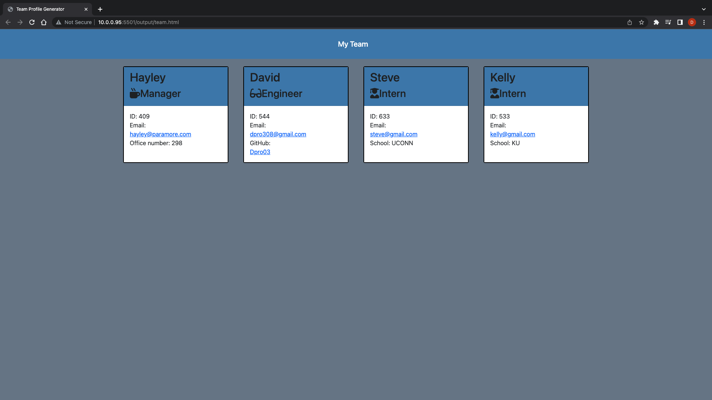

# Team-Generator

# Description

As a manager, I wanted to create a software engineering team generator command line application.  This project will prompt the team builder for information about the team manager, then input information for the remainder of the team.  The team builder can choose any number of engineers and interns to build a team around a manager.  This assignment has built in automatic testing, which must pass all unit tests.  Once the team is built, this application creates an HTML file to display a nicely formatted team roster based on the information provided by the team builder.

# User Story

AS A manager
I WANT to generate a webpage that displays my team's basic info
SO THAT I have quick access to their emails and GitHub profiles

# Acceptance Criteria

GIVEN a command-line application that accepts user input
WHEN I am prompted for my team members and their information
THEN an HTML file is generated that displays a nicely formatted team roster based on user input
WHEN I click on an email address in the HTML
THEN my default email program opens and populates the TO field of the email with the address
WHEN I click on the GitHub username
THEN that GitHub profile opens in a new tab
WHEN I start the application
THEN I am prompted to enter the team manager’s name, employee ID, email address, and office number
WHEN I enter the team manager’s name, employee ID, email address, and office number
THEN I am presented with a menu with the option to add an engineer or an intern or to finish building my team
WHEN I select the engineer option
THEN I am prompted to enter the engineer’s name, ID, email, and GitHub username, and I am taken back to the menu
WHEN I select the intern option
THEN I am prompted to enter the intern’s name, ID, email, and school, and I am taken back to the menu
WHEN I decide to finish building my team
THEN I exit the application, and the HTML is generated

# Technologies Used
<ul>
<li>Javascript</li>
<li>Node.js</li>
<li>HTML</li>
<li>CSS</li>
<li>NPM Modules</li>
</ul>

## Installation and Use

Make sure you have node.js installed.  In the command line, the user types node team.js.  The user then is prompted to enter information about the manager of the team.

After that, the user then has the option of populating the team with engineers and interns, and entering information about the team members through prompts.

Once all of the information is entered for all of the team members, the user can choose the option "I have enough team members.  Let me see my team!"

That will create a well formatted html page with the team's information, including working email and Github links so the user can stay connected with other team members.

## Link to video demonstrating application's testing and functionality

https://drive.google.com/file/d/13RDORbc0DVGgJmTrGWNDzclP78di0tcz/view

